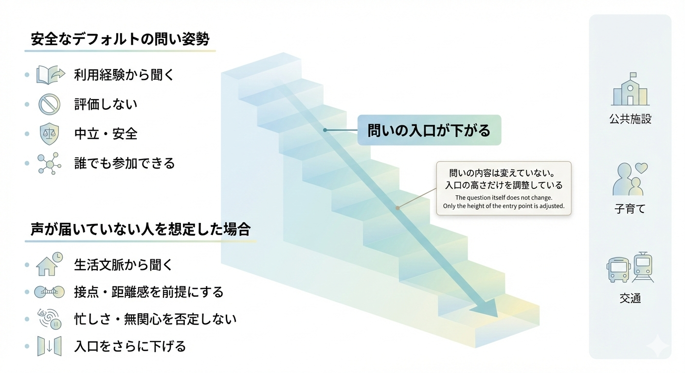

# KIKU — DesignDoc v0.1
Tagline: 問いが生まれる前に  
Product Type: 問いの設計支援アプリケーション  
Status: Draft / MVP定義段階  

---

## 1. プロダクト概要（Overview）

KIKU（きく）は、  
**「聞きたいが、どう聞けばいいか分からない人」** のための  
**問いの下書きを生成するアプリケーション**である。

KIKUは、意見を集めるフォームでも、  
集まった意見を分析するツールでもない。

KIKUが扱うのは、  
**意見が言語化される“前段階”にある問い**である。

ユーザーが置かれている状況や背景を入力すると、  
KIKUはそれをもとに  
**声が生まれやすい問いの構造（下書き）**を生成する。

生成される問いは、  
- 正解ではない  
- 完成形ではない  
- 誘導を避けた「たたき」である  

KIKUは、  
**「問いを一緒に考える相棒」**として機能する。

---

## 2. 背景と問題意識（Problem）

### 2.1 表面的な問題

- アンケートを作っても回答が集まらない
- 自由記述欄が空白になる
- 同じ人・声の大きい人の意見しか来ない

これらはよく  
「住民の関心が低い」「参加意識がない」  
と説明される。

しかし、これは本質ではない。

---

### 2.2 本質的な問題

多くの場合、問題はここにある。

- **何を聞けばいいか分からない**
- **どう聞けばいいか分からない**
- 誘導にならないか不安
- 失敗したくないという心理的負荷
- 問いの設計が属人化している

結果として、

> 「声を集めたい」という意思が  
> 行動に変わらないまま止まってしまう。

**広聴や調査は、始まる前に詰まっている。**

---

### 2.3 既存手段の限界

- Google Form や Microsoft Forms  
  → 器はあるが、問いは考えてくれない
- テンプレート  
  → 文脈に合わず、そのまま使えない
- 専門家・コンサル  
  → 重く、敷居が高い

「問いを一緒に考えてくれる軽い存在」が、  
これまで存在しなかった。

---

## 3. KIKUが解決すること / しないこと

### 3.1 解決すること

KIKUは、次を解決する。

- 問いの下書きが存在しない状態
- 「どう聞けばいいか分からない」という不安
- ゼロから問いを考える認知的負荷
- 問いの設計が個人の経験に依存している状態

---

### 3.2 解決しないこと（重要）

KIKUは、次を**解決しない**。

- 回答の質の保証
- 意見の正しさ・代表性の担保
- 合意形成
- 政策や結論の正当性

KIKUは、  
**問いを“作る”のではなく、“立ち上げる”**  
アプリケーションである。

---

## 4. 想定ユーザー（Users）

### 4.1 主なユーザー

- 自治体職員（広聴・企画・政策立案）
- 組織の人事・企画担当
- UXリサーチャー / プロダクトマネージャー
- NPO・コミュニティ運営者
- 「聞く役割」を担ってしまった人

共通点は：

> **聞く必要はあるが、聞き方に自信がない**

---

### 4.2 二次的に救われるユーザー

- 意見を求められる側（住民・利用者・社員）

KIKUは直接は使わないが、  
**問いの質が変わることで、  
意見を出しやすくなる**。

---

## 5. コア体験（Core UX）

### 5.1 入力（ユーザーが渡すもの）

ユーザーは、完成した問いを入力する必要はない。

入力するのは **状況** である。

- テーマ（ラフでよい）
- なぜ今、声を集めたいと思ったか
- これまで声が届いていないと感じる人（任意）

正確さや網羅性は求めない。

---

### 5.2 出力（KIKUが返すもの）

KIKUは、次を生成する。

- 問いの段階構造（順序）
- 設問の下書き
- 回答しやすさへの配慮
- 利用上の注意（誘導・心理的安全性）

出力は一貫して  
**「下書き」**として提示される。

---

## 6. アウトプット形式（Output）

KIKUの出力は、器に依存しない。

- 汎用的な設問リスト
- コピー可能なテキスト
- Markdown などの構造化形式

Google Form などへの変換は、  
**オプション的な一形態**にすぎない。

---

## 7. 広聴AIとの関係

- KIKU：問いが生まれる前段
- 広聴AI：集まった声を読む後段

両者は：

- 独立して存在できる
- 連携することもできる
- 互いに依存しない

KIKUは、  
**広聴AIのオンボーディングとしても機能する**が、  
広聴AI専用ではない。

---

## 8. 問いの入口を調整するという考え方（Concept / Fixed）

### 8.1 基本的な考え方

KIKUは、問いの内容そのものを変えるプロダクトではない。

同じ問いであっても、

- どこから聞き始めるか
- どの高さから参加を求めるか

によって、参加できる人の幅は大きく変わる。

KIKUはこの
**「問いの入口の高さ」** を設計対象とする。

---

### 8.2 安全なデフォルトの問い姿勢

KIKUはデフォルトとして、次の姿勢を取る。

- 利用経験から聞く
- 評価や判断を求めない
- 中立・安全である
- 誰でも参加できる

これは、
**すでに十分に配慮された、安全な入口**である。

---

### 8.3 声が届いていない人を想定した場合

これまで声が届いていない人を想定する場合、
KIKUは問いの入口を**さらに下げる**。

- 生活文脈から聞く
- 接点・距離感を前提にする
- 忙しさ・無関心を否定しない
- 参加の心理的負荷をさらに下げる

重要なのは、

> **問いの内容は変えていない。
> 入口の高さだけを調整している。**

という点である。

---

### 8.4 本図の位置づけ（固定）

本概念図は、
KIKUにおけるすべての問い設計・UX設計において、

- 判断に迷ったとき
- 機能追加を検討するとき
- 「それはKIKUらしいか？」を問うとき

に立ち返る
**判断基準として固定される**。

---

## 9. 設計原則（Design Principles）

KIKUは、次の原則を守る。

1. 正解の問いを出さない  
2. 下書きであることを隠さない  
3. 誘導を避ける構造を優先する  
4. 回答者の心理的安全性を最優先する  
5. ユーザーの不安を引き受ける  
6. 判断と責任は常に人間側に残す  

---

## 10. MVPスコープ（v0.1）

### 含めるもの

- 状況入力
- 問いの下書き生成
- コピー／書き出し

### 含めないもの

- 保存・履歴管理
- ユーザー管理
- 回答収集
- 分析・可視化

KIKU v0.1 は、  
**軽く、速く、考えるための道具**である。

---

## 11. MVP具体例（UI文言と出力例）

### 11.1 入力UI文言（そのまま使用可能）

#### 入力① テーマ

今、どんなことについて聞いてみたいですか？  
（正式な言葉でなくて大丈夫です）

例：
- 公共施設の使われ方
- 子育て支援
- まちの居心地

---

#### 入力② 背景・きっかけ

なぜ、今それを聞きたいと思いましたか？  
（思いつく範囲で大丈夫です）

例：
- 一部の人の声しか届いていない気がする  
- 若い人の声があまり見えてこない  
- 施策を考える前に、状況を知りたい  

---

#### 入力③（任意）これまで声が届いていないと感じる人

これまで、あまり声が届いていないと感じるのは  
どんな人たちでしょうか？（複数可）

- 忙しくて参加できていない人  
- 意見を言うほどではないと思っている人  
- 制度や仕組みがよく分からない人  
- 普段あまり行政と接点がない人  
- 特に思い浮かばない  

※ここで選んだからといって、  
特定の人に向けた問いになるわけではありません

---

### 11.2 想定入力例（自治体でよくあるケース）

- テーマ：公共施設の使い方  
- 背景：高齢の方からは要望が多いが、若い人や子育て世代の声がほとんど来ていない  
- 声が届いていない人：  
  - 忙しくて参加できていない人  
  - 普段あまり行政と接点がない人  

---

### 11.3 KIKUが生成する問いの下書き（例）

#### 問いの構造

この問いは、  
「意見を求める」前に、  
**日常の使われ方を思い出してもらう構成**になっています。

---

① 思い出すための問い  

最近1年くらいで、  
市内の公共施設（図書館、公園、体育館など）を  
利用したことはありますか？

- よく利用している  
- たまに利用している  
- ほとんど利用していない  
- 名前は知っているが、使ったことはない  

---

② 選びやすい問い  

利用したときの印象に、  
近いものがあれば選んでください（複数可）

- 使いやすかった  
- なんとなく入りづらかった  
- 用事がないと行かない  
- 自分向けではない気がした  
- 特に印象はない  

---

③ 書けたら書ける問い（任意）  

もしよければ、  
「こうだったら、もう少し使うかも」と思うことがあれば  
自由に書いてください。  
（書かなくても大丈夫です）

---

※ この問いは、  
意見を評価するためのものではありません。  
日常の感じ方を知るための下書きです。

---

## 12. 成功の定義（Success）

KIKUが成功している状態とは：

- ユーザーが  
  「これなら聞けそうだ」と思える
- 問いを出す前の心理的ハードルが下がる
- 完璧ではないが、動き出せる
- 広聴や対話が「始まる」

---
## 13. MVP実装の最小タスクリスト（Implementation Plan / v0.1）

本セクションは、  
**KIKU v0.1 を実装する際に「迷わないためのガードレール」**として定義される。

ここに記載されたタスクを完了した時点で、  
KIKU v0.1 は「完成」とみなす。

---

### 13.1 実装前の固定（必須）

- DesignDoc v0.1 を設計上の前提として固定する
- 「問いの入口が下がる」概念図を判断基準として採用する
- 以下を **やらないこと**として明示する：
  - 保存・履歴管理をしない
  - ユーザー管理をしない
  - 回答収集をしない
  - 分析・可視化をしない
  - 正解や最適解を出さない

---

### 13.2 UI構成（1画面のみ）

- 画面は1ページのみとする
- ページ遷移・ステップ分割・モーダルは使用しない
- 構成要素：
  - 入力① テーマ
  - 入力② 背景
  - 入力③（任意）声が届いていないと感じる人
  - 「問いの下書きを生成する」ボタン

---

### 13.3 入力③の扱い（重要）

- 技術的には optional とする
- 未選択でも必ず生成できる
- UI上は「もし迷っていたら（任意）」という位置づけとする
- 入力③は属性指定ではなく、**問いの入口を調整するヒント**として扱う

---

### 13.4 生成ロジック（最小分岐）

内部的に、次の2モードのみを持つ。

- default  
  - 利用経験 → 印象 → 仮定
  - 中立・非評価・安全

- lowered_entry  
  - 生活文脈 → 接点 → 距離感 → きっかけ
  - 忙しさ・無関心を否定しない

入力③が1つでも選択された場合のみ、  
`lowered_entry` を使用する。

---

### 13.5 出力フォーマット（固定）

- 出力は Markdown テキストとする
- 構造は以下を必ず含む：
  - 問いの構造説明
  - 複数の設問（番号付き）
  - 自由記述は最後・任意

- 出力には必ず以下を含める：

> ※ この問いは、意見を評価するためのものではありません。  
> 日常の感じ方を知るための下書きです。

---

### 13.6 トーン・語尾のガードレール

- 命令形を使わない
- 「〜すべき」を使わない
- 良い／悪いなどの評価語を使わない
- 批判や要求を前提とした表現を避ける

---

### 13.7 最低限の機能

- 問いの下書きを生成できる
- 出力全体を1クリックでコピーできる
- ページリロードで内容は消える

---

### 13.8 完成判定

以下を満たした時点で、MVPは完成とする。

- 問いが生成される
- 問いの入口が下がっている
- ユーザーが心理的に「これなら聞けそう」と感じる
- 次にもう一度使うイメージが湧く

---

## 14. 最後に

KIKUは、  
意見を集めるためのアプリではない。

**問いが生まれる前に、  
人が立ち止まらなくて済むようにするためのアプリ**である。

問いは、  
最初から完成している必要はない。

KIKUは、その前に置かれる。
